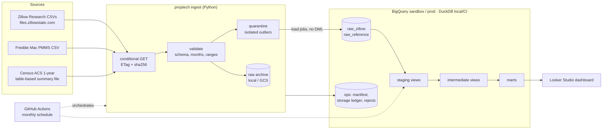

# proptech-housing-lakehouse-bigquery

[](https://github.com/rohit91jacob/proptech-housing-lakehouse-bigquery/actions/workflows/ci.yml)
[](LICENSE)
[](pyproject.toml)
[](dbt/dbt_project.yml)

This is a production-style ELT pipeline for the US housing market. It covers:

- **Sources:** Zillow Research (home values, rents, forecasts, for-sale market metrics,
  affordability), Freddie Mac PMMS mortgage rates and Census ACS household income.
- **Warehouse:** BigQuery, designed around the free **BigQuery sandbox**. That means no DML,
  a 60-day expiry and a lifetime 10 GiB storage quota.
- **Transformation:** dbt. The same project also runs on DuckDB, so every push is tested end
  to end without a cloud account.
- **Outputs:**
  - Metro, county and state price and rent trends
  - Price-to-rent ratios and rental yields
  - Mortgage affordability
  - Market-heat conditions
  - A metro momentum ranking
  - Forecast-accuracy tracking

> **Status.** The full pipeline (ingest → validate → load → `dbt build`) has been run on the
> **real** September 2026 Zillow, PMMS and ACS data in DuckDB. The BigQuery path has been
> compiled and parsed for BigQuery and unit-tested against a mocked client. It has **not yet
> run against a live GCP project**. The CI BigQuery job and the scheduled pipeline skip, with a
> notice, until credentials are configured ([docs/gcp_setup.md](docs/gcp_setup.md)).

## Architecture



| Component | Responsibility |
|---|---|
| `config/datasets.yml` | Catalog of 41 Zillow files (36 in the `core` profile). It is the single source of truth for ingestion, validation thresholds and the generated dbt sources. |
| `src/proptech` | Python loader with resilient downloads, wide-to-long parsing, load-time validation and quarantine, vintage archive, manifest, storage ledger, and BigQuery/DuckDB backends. Its CLI is `proptech`. |
| `dbt/` | Staging → intermediate → marts. Data tests, unit tests, contracts, source freshness and an exposure. |
| `.github/workflows/pipeline.yml` | Production orchestrator: a monthly schedule plus manual runs. Authenticates with Workload Identity Federation and opens an issue when a run fails. |
| `.github/workflows/ci.yml` | Lint and offline BigQuery SQL compile/parse, pytest, an end-to-end DuckDB run on fixtures, and BigQuery CI when credentials exist. |
| `.github/workflows/docs.yml` | dbt docs published to GitHub Pages. It is opt-in. |

## Tech stack

Pinned in `uv.lock` and `dbt/package-lock.yml`:

| Area | Tool | Version |
|---|---|---|
| Language | Python | 3.12 (supports 3.11–3.13) |
| Packaging | uv | lockfile `uv.lock` |
| Dataframes | polars / pyarrow | 2.0.0 / 25.0.1 |
| Warehouse | BigQuery (`google-cloud-bigquery`) | 3.46.1 |
| Local / CI warehouse | DuckDB | 1.5.6 |
| Transformation | dbt-core / dbt-bigquery / dbt-duckdb | 1.12.5 / 1.12.1 / 1.11.0 |
| dbt packages | dbt_utils | 1.4.1 |
| Config / CLI | pydantic-settings / typer | 2.15.0 / 0.27.3 |
| Quality | ruff / sqlfluff (BigQuery dialect) / pytest | 0.16.10 / 4.4.0 / 9.1.1 |
| Orchestration / CI | GitHub Actions | `pipeline`, `ci`, `docs` workflows |

## Data sources

| Source | What | Refresh | Licence / attribution |
|---|---|---|---|
| [Zillow Research](https://www.zillow.com/research/data/) | ZHVI (tiers, property types, bedrooms; country/state/metro/county, city and ZIP in `extended`), ZORI, ZHVF forecasts, inventory, listings, pending, list and sale prices, sale-to-list, price cuts, days to pending, sales, Market Heat Index, Zillow affordability, new construction | Monthly, mid-month (the Sept 2026 vintage was published on 16 Sep) | Data © Zillow Group, used under Zillow's Terms of Use with attribution to Zillow Research. **This repo doesn't redistribute Zillow data.** The pipeline downloads it at run time. Zillow's terms page was unreachable from the build machine (HTTP 403 bot protection), so review Zillow's Terms of Use (linked from the research data page) before publishing derived data. |
| [Freddie Mac PMMS](https://www.freddiemac.com/pmms) | Weekly 30- and 15-year fixed mortgage rates since 1971 | Weekly (Thursdays) | "Source: Freddie Mac Primary Mortgage Market Survey®". Not redistributed. |
| [U.S. Census Bureau ACS](https://www.census.gov/programs-surveys/acs/data/summary-file.html) | Table B19013, median household income, 1-year estimates for 2021–2024 (country, state, county, CBSA). Read from the table-based summary file, so no API key is needed. | Annual, around September | U.S. government work. "Source: U.S. Census Bureau, American Community Survey 1-Year Estimates, Table B19013." |

`tests/fixtures/sources` contains **synthetic** files generated by `proptech fixtures`. They
match the real headers and formats, but the regions, names and values are fictional.

## Data model

| Layer | Objects | Grain / keys |
|---|---|---|
| Raw | `raw_zillow.<dataset_key>` and `__regions`, plus `__history` for forecasts | `region_id × date` (long format), or `region_id` for region metadata |
| Raw | `raw_reference.pmms_weekly`, `acs_median_household_income`, `cbsa_name_candidates` | week; ACS year × geography; ACS year × CBSA × candidate |
| Ops | `ops.ingestion_manifest`, `storage_ledger`, `rejected_values` | run × object |
| Staging | `stg_zillow__observations`, `__regions`, `__forecasts`, `__forecast_history`; `stg_freddie_mac__pmms_weekly`; `stg_census__*` | dataset × region × month, etc. |
| Intermediate | `int_mortgage_rates_monthly`, `int_regions_conformed`, `int_metro_cbsa_crosswalk`, `int_household_income_by_region`, `int_zillow_series` | month; region; metro × ACS year; region × ACS year |
| Marts | `dim_region`, `dim_zillow_dataset`, `fct_home_values_monthly`, `fct_rents_monthly`, `fct_price_to_rent_monthly`, `fct_affordability_monthly`, `fct_market_heat_monthly`, `mart_metro_latest_snapshot`, `mart_metro_momentum_rankings`, `fct_forecast_accuracy` | see [docs/data_dictionary.md](docs/data_dictionary.md) |

Metric definitions (YoY, CAGR, drawdown, payment formula, income vintage, momentum score,
market-condition bands) are in [docs/data_dictionary.md](docs/data_dictionary.md#metric-definitions).

## Quickstart

### Prerequisites

- [uv](https://docs.astral.sh/uv/) 0.5+ and Python 3.12. `uv` installs Python if needed.
- `make` (optional; every target is a thin wrapper around `uv run`).
- For BigQuery only: a GCP project and credentials ([docs/gcp_setup.md](docs/gcp_setup.md)).

### 1. Local run on synthetic fixtures (no network, about 2 minutes)

```bash
uv sync
uv run dbt deps --project-dir dbt --profiles-dir dbt
make dbt-build-fixtures        # ingest fixtures into data/warehouse/fixtures.duckdb + dbt build
```

Expected tail of the output:

```text
Finished running 1 exposure, 3 seeds, 10 table models, 95 data tests, 5 unit tests, 12 view models ...
Done. PASS=125 WARN=0 ERROR=0 SKIP=0 NO-OP=1 REUSED=0 TOTAL=126
```

### 2. Local run on the real data (about 45 MB download)

```bash
uv run proptech ingest          # Zillow (core profile) + PMMS + ACS -> data/warehouse/proptech.duckdb
uv run dbt build --project-dir dbt --profiles-dir dbt
```

First run (abridged). The 12 quarantined values are real upstream outliers:

```text
| `zhvi_metro_mid_all` | loaded | 895 | 237134 | 2026-08-31 | 5.49 |  |
| `zhvi_county_mid_all` | loaded | 3071 | 708953 | 2026-08-31 | 16.51 |  |
| `homeowner_affordability_metro` | loaded | 390 | 68446 | 2026-08-31 | 1.60 | quarantined 12 values (0.018%) outside [0.0, 10.0] ... |
| `pmms_weekly` | loaded |  | 2897 | 2026-10-01 | 0.09 |  |
| `acs_median_household_income` | loaded |  | 5710 |  | 0.70 |  |
loaded: 38
```

A second run downloads nothing new and writes nothing:

```text
unchanged: 38
Storage ledger: 0.102 GiB of 8.00 GiB budget used (1.3%)
```

Then query the marts, for example with the DuckDB CLI or Python:

```sql
select momentum_rank, region_name, round(momentum_score, 2) as score,
       round(home_value_yoy_pct, 2) as hv_yoy, round(rent_yoy_pct, 2) as rent_yoy
from marts.mart_metro_momentum_rankings order by momentum_rank limit 5;
```

### 3. BigQuery (sandbox). Not yet verified against a live project.

```bash
export PROPTECH_TARGET=bigquery PROPTECH_ENV=sandbox PROPTECH_BQ_PROJECT=<project> DBT_TARGET=sandbox
export GOOGLE_APPLICATION_CREDENTIALS=/path/to/service-account.json
uv run proptech ingest --dry-run && uv run proptech ingest
uv run dbt build --project-dir dbt --profiles-dir dbt
uv run proptech budget
```

### 4. Orchestrated runs

After configuring the repository variables and secrets in [docs/gcp_setup.md](docs/gcp_setup.md),
the `pipeline` workflow runs on the 18th of every month. It can also be started from
**Actions → pipeline → Run workflow** with the inputs `deployment` (sandbox | prod),
`profile` (core | extended), `force`, and `only` (a list of dataset keys).

## Configuration

Every setting is an environment variable (or a `.env` entry); see [.env.example](.env.example).

| Variable | Default | Purpose |
|---|---|---|
| `PROPTECH_TARGET` | `duckdb` | Loader backend: `duckdb` or `bigquery` |
| `PROPTECH_ENV` | `sandbox` | BigQuery flavour: `sandbox` (no partitions, expiry refresh, budget guard) or `prod` |
| `PROPTECH_PROFILE` | `core` | Catalog profile: `core` or `extended`. dbt reads it too. |
| `PROPTECH_DUCKDB_PATH` | `data/warehouse/proptech.duckdb` | DuckDB file. dbt `local` target reads it too. |
| `PROPTECH_BQ_PROJECT` | (none) | GCP project. Required for BigQuery. |
| `PROPTECH_BQ_LOCATION` | `US` | Dataset location |
| `PROPTECH_BQ_DATASET_PREFIX` | empty | Prefix for every dataset, e.g. `ci_` |
| `DBT_TARGET` | `local` | dbt target: `local`, `sandbox`, `ci`, `prod` or `offline` |
| `GOOGLE_APPLICATION_CREDENTIALS` | (none) | Service-account key path for local BigQuery runs |
| `PROPTECH_ZILLOW_BASE_URL` | Zillow public CSV root | Accepts `file://` (used for fixtures) |
| `PROPTECH_PMMS_URL` | Freddie Mac PMMS CSV | |
| `PROPTECH_ACS_BASE_URL` | Census ACS summary-file root | |
| `PROPTECH_ACS_YEARS` | `2021,2022,2023,2024` | Unpublished years are skipped with a warning |
| `PROPTECH_RAW_ARCHIVE_URI` | `data/archive` | Local directory or `gs://bucket/prefix` |
| `PROPTECH_STORAGE_BUDGET_GIB` | `8.0` | Stop loading at this ledger total (the sandbox lifetime quota is 10 GiB) |
| `PROPTECH_SANDBOX_TABLE_TTL_DAYS` | `59` | Expiry re-stamped on sandbox tables each run (maximum 60) |
| `PROPTECH_MAX_REJECT_RATIO` | `0.001` | Quarantine up to this share of out-of-range values; fail above it |
| `PROPTECH_MAX_BYTES_BILLED` | `53687091200` | Per-query cap for the loader and dbt |
| `PROPTECH_RELAXED_VALIDATION` | `false` | Relax row-count floors for the tiny fixtures (tests and CI) |
| `PROPTECH_HTTP_TIMEOUT_SECONDS` / `PROPTECH_HTTP_RETRIES` | `120` / `5` | Download resilience: backoff on 429 and 5xx |
| `PROPTECH_LOG_LEVEL` / `PROPTECH_JSON_LOGS` | `INFO` / `true` | Structured JSON logs to stderr |

## Testing and CI

```bash
make lint    # ruff, generated-file drift check, offline BigQuery compile + sqlfluff parse
make test    # pytest: parser, validation, HTTP retries, pipeline, mocked BigQuery backend, CLI
make dbt-build-fixtures
```

| CI job (`ci.yml`) | What it proves |
|---|---|
| `lint` | Ruff passes. The generated dbt files match the catalog. **BigQuery SQL compiles** for the `prod` and `sandbox` flavours without credentials (`--target offline`, no queries run) and parses under sqlfluff's BigQuery dialect. |
| `test` | 53 pytest tests with coverage. They include sandbox load-job semantics against a mocked BigQuery client: `WRITE_TRUNCATE`, no partitions, expiry refresh, and month partitions on prod. |
| `dbt-duckdb` | End-to-end run on fixtures: ingest, then a re-ingest that must be a no-op, then `dbt build` (95 data tests, 5 unit tests, 3 contracts), `dbt source freshness` and `dbt docs generate`. |
| `bigquery-preflight` / `bigquery` | When credentials exist: ingest fixtures into `ci_` datasets and `dbt build --target ci` (everything as views, so no storage). Otherwise skipped with a notice. |

Pre-commit hooks (`uv run pre-commit install`) run ruff, YAML checks, large-file and
private-key detection, and the dbt-sources drift check.

## Operations

- **Scheduling:** the `pipeline` workflow runs monthly on the 18th, cron `0 9 18 * *`.
  Concurrency is serialised and in-flight runs are never cancelled.
- **Idempotency:** conditional GETs and sha256 skip unchanged files. Each load is a single
  atomic job. Re-running a month gives identical marts: on the real data, every mart's
  row-count and row-hash fingerprint was identical before and after a rerun.
- **Backfill and reprocessing:** Zillow republishes full history monthly, so `--force`
  reloads the latest vintage. Older vintages are archived and can be replayed.
- **Data quality:**
  - Load-time gates fail closed per dataset, with outlier quarantine.
  - dbt runs 95 data tests, including an exact match of the marts to the source, a CBSA
    coverage SLO and payment-formula checks.
  - dbt source freshness has a 35-day warning and a 45-day error.
- **Monitoring:** failures open a `pipeline-failure` issue. The job summary has a per-dataset
  table. The storage-budget gate fails at 95% of budget.

Procedures are in [docs/runbook.md](docs/runbook.md), and GCP setup is in
[docs/gcp_setup.md](docs/gcp_setup.md).

## Project structure

```text
.
├── config/datasets.yml          # catalog: 41 Zillow files, profiles, validation thresholds
├── src/proptech/
│   ├── cli.py                   # `proptech ingest | catalog | dbt-sources | budget | fixtures`
│   ├── pipeline.py              # fetch -> validate -> quarantine -> archive -> load -> manifest
│   ├── http.py                  # retries/backoff, ETag conditional GET, sha256, file:// support
│   ├── zillow.py / reference.py # wide->long Zillow parser; PMMS, ACS and CBSA-name parsing
│   ├── validation.py            # load-time DQ gate
│   ├── manifest.py / budget.py  # ops tables: ingestion manifest, sandbox storage ledger
│   ├── archive.py               # immutable vintage archive (local or GCS)
│   ├── dbt_sources.py           # generates dbt sources, catalog macro and seed from the catalog
│   ├── fixtures.py              # deterministic synthetic fixtures
│   └── warehouse/               # BigQuery (load jobs) and DuckDB backends
├── dbt/
│   ├── models/{staging,intermediate,marts}/
│   ├── macros/                  # portability, trends, generic tests, generated catalog
│   ├── seeds/                   # state codes, metro->CBSA overrides, dataset catalog (generated)
│   ├── tests/                   # singular tests
│   └── profiles.yml             # env-driven targets: local, sandbox, ci, prod, offline
├── tests/                       # pytest + synthetic fixtures under tests/fixtures/sources
├── docs/                        # data dictionary, runbook, GCP setup, ADRs
├── .github/workflows/           # ci, pipeline, docs
└── Makefile, pyproject.toml, uv.lock, .env.example, .pre-commit-config.yaml
```

## Design decisions and trade-offs

The full rationale is in [docs/adr](docs/adr).

1. **Built for the sandbox's real limits** ([ADR 0001](docs/adr/0001-bigquery-sandbox-constraints.md)).
   The sandbox has no DML, a 60-day expiry on tables, views *and partitions*, and a
   **lifetime** 10 GiB storage quota that "is not refunded upon data deletion". So the design:
   - uses load jobs only, and no incremental MERGE;
   - skips time partitioning on the sandbox;
   - refreshes expiry on every run;
   - keeps long time-series marts as views on the sandbox;
   - keeps a storage ledger with a budget gate.
2. **DuckDB as a second target** ([ADR 0002](docs/adr/0002-duckdb-as-second-target.md)). The
   full logic is tested on every push with no cloud access, and BigQuery SQL is
   compile-checked offline.
3. **GitHub Actions as the orchestrator** ([ADR 0003](docs/adr/0003-github-actions-orchestration.md)).
   This is a free, monthly, about-five-step batch. Airflow or Dagster would add infrastructure
   without adding value.
4. **Full refresh per vintage, with quarantine** ([ADR 0004](docs/adr/0004-full-refresh-and-quarantine.md)).
   Zillow restates history monthly, so only forecast vintages are accumulated.
5. **Metro → CBSA crosswalk by principal-city name, per ACS vintage** ([ADR 0005](docs/adr/0005-metro-to-cbsa-crosswalk.md)).
   All 394 metros within Zillow's top 400 size ranks are mapped on the real data.

### Verified on the real data (September 2026 vintage, DuckDB)

- **Values reproduced exactly:** 1,280 of 1,280 headline-ZHVI cells checked (US, New York,
  Los Angeles, Chicago, all months) equal Zillow's published CSV values exactly. The dbt
  singular test `assert_home_values_match_source` enforces this for every metro and month.
- **US typical home value:** $368,697 in August 2026, +1.17% YoY.
- **US affordability, August 2026:** 6.67% average 30-year rate. Principal and interest is
  $1,897 a month, which is 27.9% of the 2024 ACS median income ($81,604). Zillow's total
  payment, which adds taxes and insurance, is $2,500, or 34.1% of Zillow's implied income of
  about $87,978.
- **Momentum peers:** 100 of 100 mapped to a CBSA.
- **Rerun idempotency:** identical mart fingerprints after a rerun.

### Known limitations

- **BigQuery not yet exercised live.** The `bigquery` CI job and the scheduled pipeline will do
  that once credentials exist. Until then, behaviour is backed by the mocked-client tests and
  the offline compile.
- **Income coverage.** ACS 1-year estimates only cover areas with 65,000+ people. About 40% of
  Zillow metros, the small ones, have no income-based affordability. Zillow's own
  affordability series still covers 389 metros plus the US.
- **Forecast accuracy starts empty.** It fills in as monthly runs archive forecast vintages:
  1-month horizons after one more run, 12-month horizons after a year.
- **Approximate storage ledger.** It is an estimate of Google's sandbox counter, which isn't
  exposed, and it doesn't see writes made outside the pipeline.
- **Zillow terms not reviewed verbatim.** The terms page couldn't be fetched from the build
  machine. Check them before publishing derived data.

### Roadmap

- ACS 5-year estimates as a fallback, for full metro and county income coverage.
- An `extended` profile run on billing-enabled BigQuery, with GCS raw archive and month
  partitioning.
- A Looker Studio report linked from the `housing_market_dashboard` exposure.
- Tracking vintage revisions: how much each month restates history.

## License

The code is under the [MIT license](LICENSE). Data obtained through the pipeline remains
subject to each provider's terms; see [Data sources](#data-sources).
