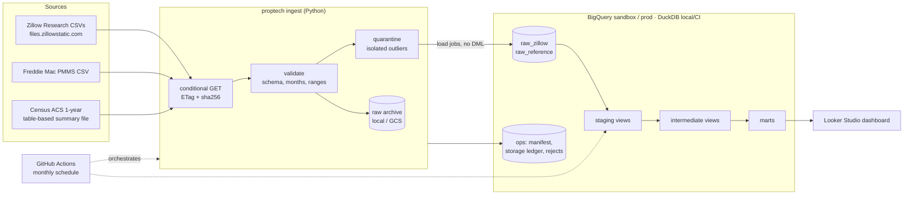

# proptech-housing-lakehouse-bigquery

[](https://github.com/rohit91jacob/proptech-housing-lakehouse-bigquery/actions/workflows/ci.yml)
[](LICENSE)
[](pyproject.toml)
[](dbt/dbt_project.yml)

This is a production-style ELT pipeline for the US housing market. It covers:

- **Sources:** Zillow Research (home values, rents, forecasts, for-sale market metrics,
  affordability), Freddie Mac PMMS mortgage rates and Census ACS household income.
- **Warehouse:** BigQuery, designed around the free **BigQuery sandbox**. That means no DML,
  a 60-day expiry and a lifetime 10 GiB storage quota.
- **Transformation:** dbt. The same project also runs on DuckDB, so every push is tested end
  to end without a cloud account.
- **Outputs:**
  - Metro, county and state price and rent trends
  - Price-to-rent ratios and rental yields
  - Mortgage affordability
  - Market-heat conditions
  - A metro momentum ranking
  - Forecast-accuracy tracking

> **Status.** The full pipeline (ingest → validate → load → `dbt build`) has been run on the
> **real** September 2026 Zillow, PMMS and ACS data, both in a **live BigQuery sandbox project**
> and in DuckDB. On BigQuery: 38 of 38 sources loaded, `dbt build` had 125 passes and 0
> failures, and all 237,134 published metro ZHVI cells matched exactly. See
> [Verified on the real data](#verified-on-the-real-data-september-2026-vintage).

## Architecture



| Component | Responsibility |
|---|---|
| `config/datasets.yml` | Catalog of 41 Zillow files (36 in the `core` profile). It is the single source of truth for ingestion, validation thresholds and the generated dbt sources. |
| `src/proptech` | Python loader with resilient downloads, wide-to-long parsing, load-time validation and quarantine, vintage archive, manifest, storage ledger, and BigQuery/DuckDB backends. Its CLI is `proptech`. |
| `dbt/` | Staging → intermediate → marts. Data tests, unit tests, contracts, source freshness and an exposure. |
| `.github/workflows/pipeline.yml` | Production orchestrator: a monthly schedule plus manual runs. It picks keyless Workload Identity Federation when configured and falls back to the `GCP_SA_KEY` secret. A credential health check runs before any load, and failures open an issue that names the credential to fix. |
| `.github/workflows/keepalive.yml` | Re-enables the scheduled workflows via the API on the 1st and 15th, so GitHub's 60-day inactivity rule never switches the monthly refresh off. |
| `.github/workflows/ci.yml` | Lint and offline BigQuery SQL compile/parse, pytest, an end-to-end DuckDB run on fixtures, and BigQuery CI when credentials exist. |
| `.github/workflows/docs.yml` | dbt docs published to GitHub Pages. It is opt-in. |

## Tech stack

Pinned in `uv.lock` and `dbt/package-lock.yml`:

| Area | Tool | Version |
|---|---|---|
| Language | Python | 3.12 (supports 3.11–3.13) |
| Packaging | uv | lockfile `uv.lock` |
| Dataframes | polars / pyarrow | 2.0.0 / 25.0.1 |
| Warehouse | BigQuery (`google-cloud-bigquery`) | 3.46.1 |
| Local / CI warehouse | DuckDB | 1.5.6 |
| Transformation | dbt-core / dbt-bigquery / dbt-duckdb | 1.12.5 / 1.12.1 / 1.11.0 |
| dbt packages | dbt_utils | 1.4.1 |
| Config / CLI | pydantic-settings / typer | 2.15.0 / 0.27.3 |
| Quality | ruff / sqlfluff (BigQuery dialect) / pytest | 0.16.10 / 4.4.0 / 9.1.1 |
| Orchestration / CI | GitHub Actions | `pipeline`, `ci`, `docs` workflows |

## Data sources

| Source | What | Refresh | Licence / attribution |
|---|---|---|---|
| [Zillow Research](https://www.zillow.com/research/data/) | ZHVI (tiers, property types, bedrooms; country/state/metro/county, city and ZIP in `extended`), ZORI, ZHVF forecasts, inventory, listings, pending, list and sale prices, sale-to-list, price cuts, days to pending, sales, Market Heat Index, Zillow affordability, new construction | Monthly, mid-month (the Sept 2026 vintage was published on 16 Sep) | Data © Zillow Group, used under Zillow's Terms of Use with attribution to Zillow Research. **This repo doesn't redistribute Zillow data.** The pipeline downloads it at run time. Zillow's terms page was unreachable from the build machine (HTTP 403 bot protection), so review Zillow's Terms of Use (linked from the research data page) before publishing derived data. |
| [Freddie Mac PMMS](https://www.freddiemac.com/pmms) | Weekly 30- and 15-year fixed mortgage rates since 1971 | Weekly (Thursdays) | "Source: Freddie Mac Primary Mortgage Market Survey®". Not redistributed. |
| [U.S. Census Bureau ACS](https://www.census.gov/programs-surveys/acs/data/summary-file.html) | Table B19013, median household income, 1-year estimates for 2021–2024 (country, state, county, CBSA). Read from the table-based summary file, so no API key is needed. | Annual, around September | U.S. government work. "Source: U.S. Census Bureau, American Community Survey 1-Year Estimates, Table B19013." |

`tests/fixtures/sources` contains **synthetic** files generated by `proptech fixtures`. They
match the real headers and formats, but the regions, names and values are fictional.

## Data model

| Layer | Objects | Grain / keys |
|---|---|---|
| Raw | `raw_zillow.<dataset_key>` and `__regions`, plus `__history` for forecasts | `region_id × date` (long format), or `region_id` for region metadata |
| Raw | `raw_reference.pmms_weekly`, `acs_median_household_income`, `cbsa_name_candidates` | week; ACS year × geography; ACS year × CBSA × candidate |
| Ops | `ops.ingestion_manifest`, `storage_ledger`, `rejected_values` | run × object |
| Staging | `stg_zillow__observations`, `__regions`, `__forecasts`, `__forecast_history`; `stg_freddie_mac__pmms_weekly`; `stg_census__*` | dataset × region × month, etc. |
| Intermediate | `int_mortgage_rates_monthly`, `int_regions_conformed`, `int_metro_cbsa_crosswalk`, `int_household_income_by_region`, `int_zillow_series` | month; region; metro × ACS year; region × ACS year |
| Marts | `dim_region`, `dim_zillow_dataset`, `fct_home_values_monthly`, `fct_rents_monthly`, `fct_price_to_rent_monthly`, `fct_affordability_monthly`, `fct_market_heat_monthly`, `mart_metro_latest_snapshot`, `mart_metro_momentum_rankings`, `fct_forecast_accuracy` | see [docs/data_dictionary.md](docs/data_dictionary.md) |

Metric definitions (YoY, CAGR, drawdown, payment formula, income vintage, momentum score,
market-condition bands) are in [docs/data_dictionary.md](docs/data_dictionary.md#metric-definitions).

## Quickstart

### Prerequisites

- [uv](https://docs.astral.sh/uv/) 0.5+ and Python 3.12. `uv` installs Python if needed.
- `make` (optional; every target is a thin wrapper around `uv run`).
- For BigQuery only: a GCP project and credentials ([docs/gcp_setup.md](docs/gcp_setup.md)).

### 1. Local run on synthetic fixtures (no network, about 2 minutes)

```bash
uv sync
uv run dbt deps --project-dir dbt --profiles-dir dbt
make dbt-build-fixtures        # ingest fixtures into data/warehouse/fixtures.duckdb + dbt build
```

Expected tail of the output:

```text
Finished running 1 exposure, 3 seeds, 10 table models, 95 data tests, 5 unit tests, 12 view models ...
Done. PASS=125 WARN=0 ERROR=0 SKIP=0 NO-OP=1 REUSED=0 TOTAL=126
```

### 2. Local run on the real data (about 45 MB download)

```bash
uv run proptech ingest          # Zillow (core profile) + PMMS + ACS -> data/warehouse/proptech.duckdb
uv run dbt build --project-dir dbt --profiles-dir dbt
```

First run (abridged). The 12 quarantined values are real upstream outliers:

```text
| `zhvi_metro_mid_all` | loaded | 895 | 237134 | 2026-08-31 | 5.49 |  |
| `zhvi_county_mid_all` | loaded | 3071 | 708953 | 2026-08-31 | 16.51 |  |
| `homeowner_affordability_metro` | loaded | 390 | 68446 | 2026-08-31 | 1.60 | quarantined 12 values (0.018%) outside [0.0, 10.0] ... |
| `pmms_weekly` | loaded |  | 2897 | 2026-10-01 | 0.09 |  |
| `acs_median_household_income` | loaded |  | 5710 |  | 0.70 |  |
loaded: 38
```

A second run downloads nothing new and writes nothing:

```text
unchanged: 38
Storage ledger: 0.102 GiB of 8.00 GiB budget used (1.3%)
```

Then query the marts, for example with the DuckDB CLI or Python:

```sql
select momentum_rank, region_name, round(momentum_score, 2) as score,
       round(home_value_yoy_pct, 2) as hv_yoy, round(rent_yoy_pct, 2) as rent_yoy
from marts.mart_metro_momentum_rankings order by momentum_rank limit 5;
```

### 3. BigQuery (sandbox)

```bash
export PROPTECH_TARGET=bigquery PROPTECH_ENV=sandbox PROPTECH_BQ_PROJECT=<project> DBT_TARGET=sandbox
export GOOGLE_APPLICATION_CREDENTIALS=/path/to/service-account.json
uv run proptech ingest --dry-run && uv run proptech ingest
uv run dbt build --project-dir dbt --profiles-dir dbt
uv run proptech budget
```

### 4. Orchestrated runs

After configuring the repository variables and secrets in [docs/gcp_setup.md](docs/gcp_setup.md),
the `pipeline` workflow runs on the 18th of every month. It refreshes BigQuery with that month's
Zillow vintage with no manual step. It can also be started from
**Actions → pipeline → Run workflow** with the inputs `deployment` (sandbox | prod),
`profile` (core | extended), `force`, and `only` (a list of dataset keys).

## Configuration

Every setting is an environment variable (or a `.env` entry); see [.env.example](.env.example).

| Variable | Default | Purpose |
|---|---|---|
| `PROPTECH_TARGET` | `duckdb` | Loader backend: `duckdb` or `bigquery` |
| `PROPTECH_ENV` | `sandbox` | BigQuery flavour: `sandbox` (no partitions, expiry refresh, budget guard) or `prod` |
| `PROPTECH_PROFILE` | `core` | Catalog profile: `core` or `extended`. dbt reads it too. |
| `PROPTECH_DUCKDB_PATH` | `data/warehouse/proptech.duckdb` | DuckDB file. dbt `local` target reads it too. |
| `PROPTECH_BQ_PROJECT` | (none) | GCP project. Required for BigQuery. |
| `PROPTECH_BQ_LOCATION` | `US` | Dataset location |
| `PROPTECH_BQ_DATASET_PREFIX` | empty | Prefix for every dataset, e.g. `ci_` |
| `DBT_TARGET` | `local` | dbt target: `local`, `sandbox`, `ci`, `prod` or `offline` |
| `GOOGLE_APPLICATION_CREDENTIALS` | (none) | Service-account key path for local BigQuery runs |
| `PROPTECH_ZILLOW_BASE_URL` | Zillow public CSV root | Accepts `file://` (used for fixtures) |
| `PROPTECH_PMMS_URL` | Freddie Mac PMMS CSV | |
| `PROPTECH_ACS_BASE_URL` | Census ACS summary-file root | |
| `PROPTECH_ACS_YEARS` | `2021,2022,2023,2024` | Unpublished years are skipped with a warning |
| `PROPTECH_RAW_ARCHIVE_URI` | `data/archive` | Local directory or `gs://bucket/prefix` |
| `PROPTECH_STORAGE_BUDGET_GIB` | `8.0` | Stop loading at this ledger total (the sandbox lifetime quota is 10 GiB) |
| `PROPTECH_SANDBOX_TABLE_TTL_DAYS` | `59` | Expiry re-stamped on sandbox tables each run (maximum 60) |
| `PROPTECH_MAX_REJECT_RATIO` | `0.001` | Quarantine up to this share of out-of-range values; fail above it |
| `PROPTECH_MAX_BYTES_BILLED` | `53687091200` | Per-query cap for the loader and dbt |
| `PROPTECH_RELAXED_VALIDATION` | `false` | Relax row-count floors for the tiny fixtures (tests and CI) |
| `PROPTECH_HTTP_TIMEOUT_SECONDS` / `PROPTECH_HTTP_RETRIES` | `120` / `5` | Download resilience: backoff on 429 and 5xx |
| `PROPTECH_LOG_LEVEL` / `PROPTECH_JSON_LOGS` | `INFO` / `true` | Structured JSON logs to stderr |

## Testing and CI

```bash
make lint    # ruff, generated-file drift check, offline BigQuery compile + sqlfluff parse
make test    # pytest: parser, validation, HTTP retries, pipeline, mocked BigQuery backend, CLI
make dbt-build-fixtures
```

| CI job (`ci.yml`) | What it proves |
|---|---|
| `lint` | Ruff passes. The generated dbt files match the catalog. **BigQuery SQL compiles** for the `prod` and `sandbox` flavours without credentials (`--target offline`, no queries run) and parses under sqlfluff's BigQuery dialect. |
| `test` | 53 pytest tests with coverage. They include sandbox load-job semantics against a mocked BigQuery client: `WRITE_TRUNCATE`, no partitions, expiry refresh, and month partitions on prod. |
| `dbt-duckdb` | End-to-end run on fixtures: ingest, then a re-ingest that must be a no-op, then `dbt build` (95 data tests, 5 unit tests, 3 contracts), `dbt source freshness` and `dbt docs generate`. |
| `bigquery-preflight` / `bigquery` | On pushes to `main` and manual runs, once credentials exist: ingest fixtures into `ci_` datasets and `dbt build --target ci`, which builds everything as views and so uses no storage. It is skipped on PRs to save the sandbox's query allowance (see below). |

Pre-commit hooks (`uv run pre-commit install`) run ruff, YAML checks, large-file and
private-key detection, and the dbt-sources drift check.

## Operations

- **Scheduling:** the `pipeline` workflow runs monthly on the 18th, cron `0 9 18 * *`.
  Concurrency is serialised and in-flight runs are never cancelled.
- **Staying scheduled:** GitHub disables scheduled workflows in public repos after 60 days
  without repository activity. The `keepalive` workflow re-enables `pipeline` (and itself)
  through the API twice a month, without commits.
- **Authentication:** see the table below.

  | Method | Configured by | Expires | Selected when |
  |---|---|---|---|
  | Workload Identity Federation (keyless, recommended) | variables `GCP_WORKLOAD_IDENTITY_PROVIDER` + `GCP_SERVICE_ACCOUNT` | never: GitHub mints a short-lived OIDC token each run | both variables are set |
  | Service-account JSON key | secret `GCP_SA_KEY` | never by default; rotate it yearly | WIF is not configured |

  `GCP_PROJECT_ID` is set to `proptech-housing`. Without it the project comes from the key or the
  service-account email. The selection logic is `src/proptech/ci_auth.py`, and it is unit-tested.
- **Credential health check:** `proptech healthcheck` lists one dataset and dry-runs `SELECT 1`
  (free) before anything loads. A revoked key, missing role or disabled API fails the run and
  opens a `Pipeline credential failure` issue that names the fix. A scheduled run with no
  credential at all opens `Pipeline credentials missing`. GitHub also emails the repo owner
  about failed scheduled runs.
- **Idempotency:** conditional GETs and sha256 skip unchanged files. Each load is a single
  atomic job. Re-running a month gives identical marts: on the real data, every mart's
  row-count and row-hash fingerprint was identical before and after a rerun.
- **Backfill and reprocessing:** Zillow republishes full history monthly, so `--force`
  reloads the latest vintage. Older vintages are archived and can be replayed.
- **Data quality:**
  - Load-time gates fail closed per dataset, with outlier quarantine.
  - dbt runs 95 data tests, including an exact match of the marts to the source, a CBSA
    coverage SLO and payment-formula checks.
  - dbt source freshness has a 35-day warning and a 45-day error.
- **Monitoring:** failures open a `pipeline-failure` issue. The job summary has a per-dataset
  table. The storage-budget gate fails at 95% of budget.

Procedures are in [docs/runbook.md](docs/runbook.md), and GCP setup is in
[docs/gcp_setup.md](docs/gcp_setup.md).

## Project structure

```text
.
├── config/datasets.yml          # catalog: 41 Zillow files, profiles, validation thresholds
├── src/proptech/
│   ├── cli.py                   # `proptech ingest | catalog | dbt-sources | budget | healthcheck | fixtures`
│   ├── pipeline.py              # fetch -> validate -> quarantine -> archive -> load -> manifest
│   ├── http.py                  # retries/backoff, ETag conditional GET, sha256, file:// support
│   ├── zillow.py / reference.py # wide->long Zillow parser; PMMS, ACS and CBSA-name parsing
│   ├── validation.py            # load-time DQ gate
│   ├── manifest.py / budget.py  # ops tables: ingestion manifest, sandbox storage ledger
│   ├── archive.py               # immutable vintage archive (local or GCS)
│   ├── dbt_sources.py           # generates dbt sources, catalog macro and seed from the catalog
│   ├── fixtures.py              # deterministic synthetic fixtures
│   ├── healthcheck.py           # free BigQuery credential check with a fix-it diagnosis
│   ├── ci_auth.py               # CI auth selection: WIF > key > none (stdlib only)
│   └── warehouse/               # BigQuery (load jobs) and DuckDB backends
├── dbt/
│   ├── models/{staging,intermediate,marts}/
│   ├── macros/                  # portability, trends, generic tests, generated catalog
│   ├── seeds/                   # state codes, metro->CBSA overrides, dataset catalog (generated)
│   ├── tests/                   # singular tests
│   └── profiles.yml             # env-driven targets: local, sandbox, ci, prod, offline
├── tests/                       # pytest + synthetic fixtures under tests/fixtures/sources
├── docs/                        # data dictionary, runbook, GCP setup, ADRs
├── .github/workflows/           # ci, pipeline, keepalive, docs
└── Makefile, pyproject.toml, uv.lock, .env.example, .pre-commit-config.yaml
```

## Design rationale

Four constraints drove the design. There is no billing account, so the warehouse is the free
BigQuery sandbox: no DML or streaming, a 60-day expiry on tables, views *and partitions*, a
**lifetime** 10 GiB storage quota that "is not refunded upon data deletion", and a 1 TiB
monthly query allowance. The data is real and public, but the repo redistributes none of it,
so the pipeline downloads it at run time and tests run on synthetic fixtures. Zillow restates
the full history of every series each month. Finally, the refresh has to run unattended on
free GitHub-hosted runners, while every change is tested end to end without a cloud account.
The full reasoning is in the ADRs under [docs/adr](docs/adr).

### Architecture decisions

| Decision | Why | Alternatives considered | Trade-off accepted |
|---|---|---|---|
| **No DML: Parquet load jobs only** ([ADR 0001](docs/adr/0001-bigquery-sandbox-constraints.md)) | The sandbox rejects DML and streaming. `WRITE_TRUNCATE` replaces a table atomically, `WRITE_APPEND` grows the ops tables and forecast history (`src/proptech/warehouse/bigquery_backend.py`), and dbt models are only `table` or `view`. | Incremental `MERGE` models; streaming inserts | A changed dataset is rewritten in full, and append-only rows can't be corrected in place. |
| **Sandbox-aware materialisation and expiry** ([ADR 0001](docs/adr/0001-bigquery-sandbox-constraints.md)) | `proptech_materialization()` in `dbt/macros/platform.sql` makes the five `*_monthly` fact marts views on `sandbox`, so they use no storage, and every model a view on `ci`. Sandbox partitions expire 60 days after their partition date, so month partitioning is `prod`-only and tables are clustered instead. Every run re-stamps expiry to +59 days, unchanged tables included. | Tables with month partitions on every target | Queries on the long series recompute from raw each time, spending query allowance instead of storage. |
| **Storage ledger with a budget gate** (`src/proptech/budget.py`) | Google doesn't expose the sandbox's lifetime counter. `ops.storage_ledger` estimates the logical bytes each load and dbt table writes. Loads stop at `PROPTECH_STORAGE_BUDGET_GIB` (8 of the 10 GiB), and the workflow halts before loading above 95% of it. | Reading current table sizes, which drop after a delete while the quota doesn't | An estimate, not Google's number (within 0.3% on the live run). |
| **Full refresh per vintage, skipped when unchanged** ([ADR 0004](docs/adr/0004-full-refresh-and-quarantine.md)) | Zillow restates history monthly, so appending the newest month would mix vintages. ETag conditional GETs and sha256 checks against `ops.ingestion_manifest` skip unchanged files, so a rerun loads nothing. Forecast vintages are the one history kept, appended once per base date. | Append-only monthly increments; reloading every file on every run | A new vintage of every core file costs about 100 MiB of quota. BigQuery holds only the latest vintage; older ones live in the raw archive (`src/proptech/archive.py`). |
| **Fail closed per dataset, quarantine isolated outliers** ([ADR 0004](docs/adr/0004-full-refresh-and-quarantine.md)) | `src/proptech/validation.py` checks columns, contiguous month-ends, region counts and value ranges before loading. Up to 0.1% out-of-range values go to `ops.rejected_values`. A higher share fails the dataset, which keeps its previous vintage, and the run exits non-zero. | Testing only in dbt after the load; dropping outliers silently; failing the whole run | Ranges must be set from observed data, and a failed dataset stays a vintage behind the rest until fixed. |
| **One dbt project on BigQuery and DuckDB** ([ADR 0002](docs/adr/0002-duckdb-as-second-target.md)) | The full pipeline runs on every PR and push to `main` with no credentials and no quota. Dialect differences sit in a few macros (`dbt/macros/platform.sql`, `dbt/macros/trends.sql`), and CI compiles the BigQuery SQL offline for `prod` and `sandbox`. | A BigQuery-only project, which can only be parsed without credentials | DuckDB accepts some SQL that BigQuery rejects, so the `bigquery` CI job on `main` stays the final check (see [Known limitations](#known-limitations)). |
| **GitHub Actions as the orchestrator** ([ADR 0003](docs/adr/0003-github-actions-orchestration.md)) | Free, auditable and versioned with the code, for one monthly batch of about five steps. Runs are serialised, check the credential first (`proptech healthcheck`), prefer keyless Workload Identity Federation over the key (`src/proptech/ci_auth.py`) and open an issue on failure. | Airflow or Dagster (an always-on host); Cloud Scheduler with Cloud Run jobs (needs billing) | No task-level retries or partial reruns, so runs are idempotent instead. GitHub disables schedules after 60 idle days, so `keepalive.yml` re-enables them. |
| **The catalog is the single source of truth** (`config/datasets.yml`) | One YAML entry per Zillow file sets its path, profiles and validation thresholds. `proptech dbt-sources` generates the dbt sources, catalog macro and dataset seed from it (`src/proptech/dbt_sources.py`), and staging unions only the loaded profile's tables. | Hand-written dbt sources and a staging model per file | Generated files must be regenerated and committed. CI and a pre-commit hook fail on drift. |
| **Metro → CBSA by principal-city name, per ACS vintage** ([ADR 0005](docs/adr/0005-metro-to-cbsa-crosswalk.md)) | No crosswalk is published alongside Zillow's CSVs, and CBSA delineations change between ACS vintages. Ranked `"City, ST"` candidates plus an overrides seed map all 394 metros within Zillow's top 400 size ranks on the real data. | A static crosswalk file | Ties are left unmapped rather than guessed. A 5% coverage test on the peer metros catches a delineation change that breaks matching. |

### Stack choices

| Layer | Choice | Why this | Why not the alternatives |
|---|---|---|---|
| Language and packaging | Python 3.12 (3.11–3.13 supported); uv with `uv.lock` | dbt, the BigQuery client and polars are all Python, so the loader, dbt and tests share one environment. One lockfile pins the loader, dbt and the dev tools, CI installs it frozen (`UV_FROZEN=1`), and uv installs Python itself. | Poetry and pip-tools also pin versions, but they run on an existing Python; uv is one binary that also fetches the interpreter. |
| Dataframes | polars 2.0.0, pyarrow 25.0.1 | Zillow files are wide, with a new month column every vintage. polars unpivots them into a stable long layout with explicit schemas and strict casts (`src/proptech/zillow.py`). Its Arrow data goes straight into DuckDB and, as zstd Parquet, into BigQuery load jobs. | Loading the wide CSVs unchanged would alter the raw schema every month. Spark would add a JVM for a core download of about 45 MB. pandas would cope at this size; polars was picked for strict schemas and Arrow-native memory. |
| Warehouse | BigQuery (`google-cloud-bigquery` 3.46.1) | The sandbox needs no billing account, is serverless, and supports load jobs and `CREATE OR REPLACE`. Looker Studio connects to it at no cost, and leaving the sandbox is a configuration change (`PROPTECH_ENV=prod`, `DBT_TARGET=prod`). | Snowflake and Redshift start on trial credits that run out; the sandbox doesn't need a billing account at all. |
| Local and CI warehouse | DuckDB 1.5.6 | In-process and file-based, so CI needs no server or credentials. It holds the same raw layout behind one `Warehouse` interface (`src/proptech/warehouse/`), writes each table in a transaction, and accepts `QUALIFY` and `RANGE` frames, so most models need no dialect switch. | SQLite has no `QUALIFY` or native date type. Postgres would need a service container in every CI job. |
| Transformation | dbt-core 1.12.5, dbt-bigquery 1.12.1, dbt-duckdb 1.11.0, dbt_utils 1.4.1 | One SQL project runs on both engines through adapters, with five targets chosen by `DBT_TARGET` (`local`, `sandbox`, `ci`, `prod`, `offline`). Data tests, unit tests, contracts, source freshness, the exposure and docs live in the same project. | Dataform runs only on BigQuery, which would lose the DuckDB path. SQL run from Python scripts would need its own tests, lineage and docs. |
| Config and CLI | pydantic-settings 2.15.0, typer 0.27.3 | Every setting is a typed `PROPTECH_*` variable or `.env` entry, validated at start-up (`src/proptech/settings.py`), and pydantic models validate the catalog too. typer builds the `proptech` CLI from type hints. | `os.environ` lookups and argparse would leave validation to hand-written code. Plain click needs more boilerplate for the same commands. |
| Quality | ruff 0.16.10, sqlfluff 4.4.0 (BigQuery dialect), pytest 9.1.1 | ruff lints and formats in one tool. sqlfluff parses the offline-compiled BigQuery SQL, so BigQuery syntax is checked without credentials. pytest covers parsing, validation, HTTP retries and load-job semantics against a mocked BigQuery client. | flake8, black and isort would be three tools for ruff's one. Running the live `bigquery` job on every PR would eat into a query allowance that covers about 40 builds a month. |
| Orchestration and CI | GitHub Actions (`pipeline`, `ci`, `keepalive`, `docs`); `google-github-actions/auth` v2 | Free for a public repo, and next to the code and the issues used for alerts. It supplies the cron schedule, `concurrency`, per-deployment environments and the OIDC token behind keyless Workload Identity Federation. | GitLab CI or CircleCI would add a second service and another set of credentials. The scheduler alternatives are in the orchestration decision above. |

### What would change in production

- **Billing-enabled BigQuery** (`PROPTECH_ENV=prod`, `DBT_TARGET=prod`). The five `*_monthly`
  fact marts become month-partitioned tables, the raw time series are partitioned by month,
  and the expiry re-stamp and the loader's budget guard switch off. The workflow's storage gate
  (`proptech budget --fail-above 0.95`) still runs on `prod`, so cost control would move to a
  GCP billing budget and the existing `maximum_bytes_billed` cap, with the gate dropped or
  `PROPTECH_STORAGE_BUDGET_GIB` raised.
- **A durable raw archive.** Unless the `RAW_ARCHIVE_URI` variable is set, `pipeline` runs
  archive to the runner's workspace, which is discarded after the job. Production would point
  it at a GCS bucket. `src/proptech/archive.py` already writes there without overwriting
  (`if_generation_match=0`), but that path hasn't been run yet.
- **Keyless auth only.** The workflows already prefer Workload Identity Federation, but the
  live sandbox still authenticates with the `GCP_SA_KEY` JSON key
  ([docs/gcp_setup.md](docs/gcp_setup.md)). Production would configure the pool and delete the
  key, and would pre-create the datasets so `bigquery.dataEditor` can be granted on them
  instead of on the whole project.
- **A scheduler with retries.** With billing on, Cloud Scheduler and Cloud Run jobs are the
  natural replacement for GitHub Actions
  ([ADR 0003](docs/adr/0003-github-actions-orchestration.md)). The `proptech` and `dbt` steps
  port directly, each job gets its own retries, and there is no 60-day schedule lapse to work
  around.
- **Full coverage at scale.** The `extended` profile (city and ZIP, about 0.5 GiB of logical
  storage per load) would run routinely on billing-enabled BigQuery, with month partitioning
  and the GCS archive. None of these has been run yet. The `bigquery` CI job could then run on
  every PR against a dev project, catching engine drift before it reaches `main`.

## Verified on the real data (September 2026 vintage)

Both the live BigQuery sandbox project and DuckDB were checked.

- **Values reproduced exactly:**
  - BigQuery: all 237,134 published metro ZHVI cells (895 regions, every month) equal
    Zillow's CSV, with no extra rows.
  - DuckDB: 1,280 of 1,280 cells checked match.
  - The dbt singular test `assert_home_values_match_source` enforces this on every build.
- **Same results on both engines:** every mart has the same row count on BigQuery and DuckDB,
  for example 2,858,516 rows in `fct_home_values_monthly`. Affordability figures and rankings
  are identical too.
- **BigQuery sandbox behaviour observed:**
  - Datasets carry a forced 60-day default table and partition expiration
    (`5184000000` ms).
  - Updating a table's `expires` *is* allowed. The loader's re-stamp to +59 days took effect.
  - Load jobs and `CREATE OR REPLACE TABLE/VIEW` work. No DML is used.
- **Storage:** 103.25 MiB is stored after a full core load and `dbt build`. 101.7 MiB of that
  is raw, and the marts are 0.68 MiB because the long series are views. The ledger estimate
  is 103.54 MiB: the conservative estimate is within 0.3%.
- **Query allowance:** one sandbox `dbt build` (126 nodes, about 95 of them tests) processes
  1.07 GiB but bills 23.6 GiB, because BigQuery bills a 10 MiB minimum per table per query.
  The free 1 TiB/month therefore covers about 40 builds, which is why BigQuery CI doesn't run
  on PRs.
- **US typical home value:** $368,697 in August 2026, +1.17% YoY.
- **US affordability, August 2026:** 6.67% average 30-year rate. Principal and interest is
  $1,897 a month, which is 27.9% of the 2024 ACS median income ($81,604). Zillow's total
  payment, which adds taxes and insurance, is $2,500, or 34.1% of Zillow's implied income of
  about $87,978.
- **Momentum peers:** 100 of 100 mapped to a CBSA.
- **Rerun idempotency:**
  - On BigQuery, a second ingest left all 38 sources unchanged and wrote 0 bytes.
  - A second `dbt build` reproduced the same per-mart `bit_xor(farm_fingerprint(...))`
    digest (`83fb0f244d9a62bc`).
  - DuckDB fingerprints were identical as well.

## Known limitations

- **DuckDB isn't a perfect stand-in for BigQuery.** The first live BigQuery build caught four
  issues that DuckDB accepted:
  - `BIGINT` isn't a valid seed or load-schema type.
  - `WHERE` without `FROM` is rejected.
  - The DATE vs TIMESTAMP comparison in `dbt_utils.recency` fails.
  These are fixed. BigQuery CI on `main` is the guard against this kind of drift.
- **Income coverage.** ACS 1-year estimates only cover areas with 65,000+ people. About 40% of
  Zillow metros, the small ones, have no income-based affordability. Zillow's own
  affordability series still covers 389 metros plus the US.
- **Forecast accuracy starts empty.** It fills in as monthly runs archive forecast vintages:
  1-month horizons after one more run, 12-month horizons after a year.
- **Approximate storage ledger.** It is an estimate of Google's sandbox counter, which isn't
  exposed, and it doesn't see writes made outside the pipeline. Each run that rebuilds the
  snapshot marts adds about 0.7 MiB.
- **Zillow terms not reviewed verbatim.** The terms page couldn't be fetched from the build
  machine. Check them before publishing derived data.

## Roadmap

The production move (billing-enabled BigQuery, the `extended` profile, the GCS archive) is
described in [What would change in production](#what-would-change-in-production). Beyond it:

- ACS 5-year estimates as a fallback, for full metro and county income coverage.
- A Looker Studio report linked from the `housing_market_dashboard` exposure.
- Tracking vintage revisions: how much each month restates history.

## License

The code is under the [MIT license](LICENSE). Data obtained through the pipeline remains
subject to each provider's terms; see [Data sources](#data-sources).
